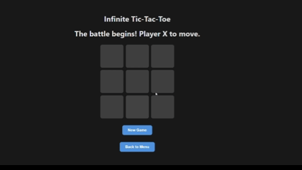

# Infinite Tic-Tac-Toe: Powered by a Minimax AI

A full-stack, AI-powered web application featuring a unique 'cyclic' version of Tic-Tac-Toe that ensures a winner is always reached. This project was built from scratch to demonstrate skills in backend development, frontend development, data structure, and artificial intelligence.

## Live Demo

[(https://infinite-tic-tac-toe-six.vercel.app/)]

## Gameplay GIF



## Project Overview

The classic game of Tic-Tac-Toe often ends in a draw, making it predictable and frustrating. This project introduces a "cyclic" rule: each player can only have three pieces on the board. On a player's fourth move, their oldest piece is removed, creating a dynamic and strategic game that never ends in a stalemate.

## Key Features

- **Cyclic Gameplay:** A unique rule that eliminates draws and adds strategic depth.

- **Unbeatable AI:** A powerful AI opponent built with the Minimax algorithm that plays perfectly.

- **Full-Stack Architecture:** A complete separation between the Python/FastAPI backend and the React frontend.

- **RESTful API:** A well-defined API to manage game creation, player moves, and AI turns.

## Tech Stack

- **Backend:** Python, FastAPI

- **Frontend:** JavaScript, React.js

- **AI Algorithm:** Minimax

- **Version Control:** Git & GitHub

## How to Run Locally

1.  Clone the repository.

2.  **Backend Setup:**

```bash

cd backend

python -m venv venv

source venv/bin/activate  # or venv\Scripts\activate on Windows

pip install -r requirements.txt

uvicorn api:app --reload

```

3.  **Frontend Setup:**

```bash

cd frontend

npm install

npm start

```
